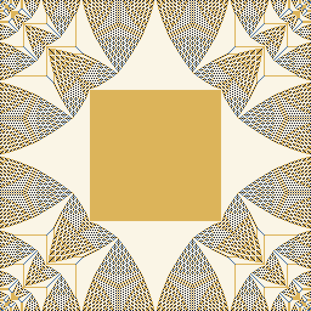
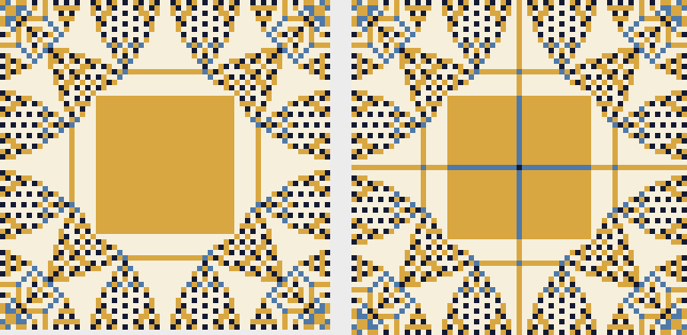

# The Sandpile Identity

A free-time exploration (Sep 27, 2026) of the identity element of the Abelian sandpile group
on a square grid, a fractal-looking pattern whose large-grid limit is still an open problem.

- **Live page:** https://claude.ai/artifact/9kfqMDpKnFbNzhAqUNpxrS (private until shared)
- **`sandpile.html`**: the same page. Open it in any browser; it runs offline except for web fonts.
- **`sand.py`**: numpy version that reproduces every number below (`python sand.py check`, etc.).
- **`images/`**: the 64 and 256 identities, the 2^16-grain single pile, and a screenshot of the page.

## The model

Each cell holds grains. A cell with 4 or more topples, giving one grain to each neighbour; grains
pushed off the edge are lost. The final pile and the number of topples don't depend on order
(Dhar 1990). Stable piles that can be reached from any pile by adding sand are *recurrent*, and they
form a group under "add cell by cell, then stabilize." Its identity is `e = stab(6 − stab(6))`.
The difference `6 − stab(6)` is equivalent to the empty pile and is ≥ 3 everywhere, so
stabilizing it gives the unique recurrent pile equivalent to nothing.

## Findings

| Check | Result |
|---|---|
| `e + e` stabilizes to `e` | True at 16, 64, 128, 256 |
| 128×128 identity | 49,222,748 topples; heights 0/1/2/3 = 1,664 / 568 / 5,368 / 8,784 |
| Same count from the JS page | 49,222,748, with a completely different toppling order (the abelian property) |
| Topples vs grid size | about ×16 per doubling, so roughly n⁴ |
| Group size = ∏ (4 − 2cos(jπ/(m+1)) − 2cos(kπ/(n+1))) | matches brute force on 1×1, 2×2, 3×2, 3×3 (4, 192, 2415, 100352) |
| 128×128 group size | ≈ 1.01 × 10^8329 |

What stands out: a solid square of 2s at the centre, cusped regions of 3s, and periodic textures
that sharpen as the grid grows rather than changing. The single-source pile (many grains on one
cell) uses similar textures. Levine–Pegden–Smart tied those to Apollonian circle packings. Whether
the identity shares that explanation is unproved.

**Not verified:** a claim seen in search results that it is still open to prove the central
constant square exists. I couldn't trace it to a primary source, so it's left off the page.

## Second session: odd grids and the square's size

Built `tools/sandid.c` (MSVC 2019, `tools\build.bat`), the same worklist toppling as the page but
compiled: 512×512 in 101 s (12.2 billion topples). Raw outputs are in `data/`.

### Odd grids contain the even grid one size down

On a (2k+1)-grid the identity has a cross of lower values on its middle row and column (1s through
the square, 0 at the centre). **Delete the cross and the remaining cells equal the 2k identity
exactly.** Checked for every k from 2 to 128 (odd sides 5–257): zero mismatched cells
(`data/seam_2_128.csv`, column `quadrant_bad`).

My first guess for the cross, "neighbour minus 1", is wrong: it fails somewhere on the cross for
30 of those 127 sizes. The
correct description is from the toppling counts. With `u = a1 − a2` the net toppling counts of
the 2k identity computation (`e = L u`), the cross value at column j is the second difference
`2u(j) − u(j−1) − u(j+1)` along the row beside the midline, and the centre is 0. This matched the
real cross exactly on every odd size from 5 to 129 (numpy, checked one by one).

**Partial proof.** Build V on the odd grid: u in the quarters, and each cross cell copies its
neighbour's value. Then `L_odd V` is the even identity on the quarters (u is mirror-symmetric),
the second differences on the arms, and 0 at the centre, so it is equivalent to the empty pile.
If the arm values lie in [1, 3] it is also stable and recurrent. For recurrence, take any
forbidden subconfiguration F. Unions and mirror images of forbidden sets are forbidden, so F can
be taken symmetric. Then F's quarter cells would form a forbidden set for the recurrent even
identity, so F lies inside the cross. The arm cell of F nearest the border has one F-neighbour
and at least 1 grain, so F is empty. By uniqueness, that pile is the odd identity.
**Unproved:** that the second differences stay in [1, 3]. They are always 1 or 2 for odd sizes
5–129, the range where I computed them directly.

### Is a full proof within reach? (checked on rectangles)

The same rule, deleting the middle column of an h×(2k+1) rectangle to get h×2k, **fails on 264 of
1,200 rectangles** (h ≤ 40, width ≤ 61). For each odd width w it holds for every height below a
sharp threshold and fails for every height above it. The threshold is about 1.35–1.4 w
(w=11: fails from h=16; w=21: from 28; w=31: from 42). So the result is not a soft symmetry fact:
any proof has to use quantitative information about the square's shape.

The failure is always the **lower** bound: the seam second difference drops to 0 (the maximum is
always 2). Refined criterion: with s the seam values, the rule holds **iff** 0 ≤ s ≤ 3 and s has no
run of the form 0,1,…,1,0 (a run like that is exactly a forbidden subconfiguration inside the seam).
The "if" direction is the proof above; the criterion matched the actual outcome on **900 of 900**
rectangles (h ≤ 60, odd width ≤ 31).

So the open step is equivalent to a real quantitative statement: on square grids, the toppling
counts along the row beside the midline have second difference ≥ 1, apart from isolated zeros.
That is a pointwise bound on second differences of the toppling potential, the kind of control the
known scaling-limit results don't give. The most promising route is an exact description of the
identity near the midline, in the spirit of Le Borgne–Rossin's analysis of long rectangles.

### Trying the Le Borgne–Rossin route

Paper read in full (HAL preprint hal-00016377 via CORE). Their method: an explicit pile D ≡ 0
that is 2 everywhere plus stacks on the four corner diagonals; D ≥ 2, so stab(D) is the identity.
On long rectangles they bound the avalanche from the stacks so it never reaches the middle band.
(Their Theorem 5 itself leans on a stated conjecture, "R′ ≥ R", with a fuller proof promised.)

Rebuilt it: D = L W with the explicit toppling function **W = 2Pd − d² + d** (d = distance from the
border, P = half the width). stab(D) matched the identity on every size checked. Their avalanche's
toppling counts are a = W − u, and W has second difference exactly −2 along the row beside the
midline, so the missing step becomes:

> **1 ≤ s ≤ 3 ⇔ along the row beside the midline, the second difference of their toppling counts a
> lies in [−1, 1].**

What the data shows is stronger and very regular: along that row a is concave and piecewise linear
with integer slopes that drop by exactly 1 at each break (m = 32: 8, 15, 22, …, 71, 77, 82, 86, 89,
91, 92). Second differences are only −1 or 0 for **every even m from 4 to 128**, which is exactly
s ∈ {1, 2}.

**Why this still isn't a proof.** Every cell on that row topples, so the avalanche can't simply be
shown to miss the midline (the way the rectangle proof works). What's needed is second-order
control (concavity with unit slope drops), while their Theorem 1 technique gives only first-order
monotonicity along lines, and even that only for cells two apart; they note adjacent-cell
monotonicity is experimental. Rounding down to whole topplings does not preserve concavity, so their
round-by-round induction doesn't carry over. And the property is special to that one row: on every
other row the second differences range from about −m to +2 (m = 32, 64, 128), so there is no
grid-wide invariant to induct on. The row is where the top-left and bottom-left avalanches meet
head-on, and a proof would need an exact description of that collision.

### The central square is about 5/12 of the width

For even n the side of the centred all-2 square grows in steps of 2 (it is 0 for odd n because
of the cross). Fit over n = 8..256 plus 512: `side ≈ 0.4170 n + 0.56`. Candidate slopes, compared
by their mean residual on small vs large grids:

| slope | mean residual, n = 16..128 | n = 130..512 |
|---|---|---|
| 5/12 = 0.41667 | +0.596 | +0.615 (flat) |
| √2 − 1 = 0.41421 | +0.773 | +1.101 (drifts up) |
| 0.42 | +0.356 | −0.044 (drifts down) |

**1024×1024** (193 billion topples, 26 min): side **428**. 5/12 predicts ≈ 427 (residual +1.33, inside its
earlier band of −0.67..+1.83); √2 − 1 would leave a residual of +3.8, outside its earlier band; 0.42 gives −2.08.
Height shares at 1024: 0/1/2/3 = 10.7% / 2.6% / 30.3% / 56.4%, mean 2.324.

Other numbers: topples grow like n^3.95; the share of 3s keeps rising (50.6% at 64, 55.9% at 512)
and the mean height with it (2.275 → 2.319 → 2.324 at 1024), so the height mix is still drifting.
At 512 a faint octagon of 2s surrounds the square (`images/id_512.png`, a line 40 cells above it on
the centre column); it is absent at 256 and at 1024, so it is a size-specific detail, not a trend.

## Sources

1. D. Dhar, "Self-organized critical state of sandpile automaton models," *PRL* 64 (1990) 1613.
2. Y. Le Borgne, D. Rossin, "On the identity of the sandpile group," *Discrete Math.* 256 (2002) 775–790.
3. S. Caracciolo, G. Paoletti, A. Sportiello, "Explicit characterization of the identity configuration
   in an abelian sandpile model," *J. Phys. A* 41 (2008) 495003.
4. W. Pegden, C. K. Smart, "Convergence of the abelian sandpile," *Duke Math. J.* 162 (2013).
5. L. Levine, W. Pegden, C. K. Smart, "Apollonian structure in the Abelian sandpile," *GAFA* 26 (2016).
   [arXiv:1208.4839](https://arxiv.org/abs/1208.4839)
6. L. Levine, Y. Peres, "Laplacian growth, sandpiles and scaling limits," *Bull. AMS* (2017).
   [arXiv:1611.00411](https://arxiv.org/abs/1611.00411). Lists the identity's scaling limit as open.
7. L. Florescu, D. Morar, D. Perkinson, N. Salter, T. Xu, "Sandpiles and dominos" (2014).
   [arXiv:1406.0100](https://arxiv.org/abs/1406.0100). Symmetric sandpiles via folding; even/odd cases.
8. R. Kaiser, E. Sava-Huss, "Scaling limit of the sandpile identity element on the Sierpinski
   gasket" (2023). [arXiv:2308.12183](https://arxiv.org/abs/2308.12183)

## Ideas not yet tried

- Prove the [1, 3] bound on the cross values, or find a grid where it fails.
- Does 5/12 survive at 2048? (Roughly 16× the 1024 run; use the quadrant symmetry for a 4× speedup.)
- Other lattices (triangular, hexagonal) and other sink choices.
- A Web Worker so 512×512 grids don't block the page.
